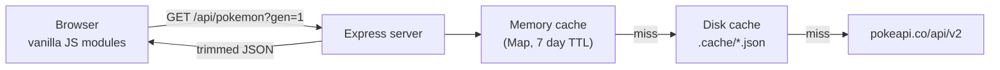

# Pokedex - Third Party API Challenge

A full stack Pokedex web app built on [PokeAPI v2](https://pokeapi.co/docs/v2).

- **Backend:** Node.js + Express. Proxies and caches PokeAPI, and trims its large responses down to what the UI needs.
- **Frontend:** Plain HTML, CSS, and vanilla JavaScript ES modules. No framework, no bundler, no build step.
- **Course:** ITCC14 - Team Pokemon

---

## Table of contents

- [What the app does](#what-the-app-does)
- [How it works](#how-it-works)
- [Running it locally](#running-it-locally)
- [Configuration and API keys](#configuration-and-api-keys)
- [API reference](#api-reference)
- [Project structure](#project-structure)
- [Deploying](#deploying)
- [Troubleshooting](#troubleshooting)
- [Credits](#credits)

---

## What the app does

### Interactive features

| Feature | What it does |
| --- | --- |
| **Live search** | Filters as you type, by name fragment (`char`) or Pokedex number (`25`, `025`, `#150`). Debounced by 150 ms. |
| **Multi-type filter** | 18 clickable type badges. Select several to broaden the search, or tick **Match all** to require every selected type on the same Pokemon (`Fire` + `Flying` narrows Gen 1 to Charizard and Moltres). |
| **Stat sliders** | Minimum and maximum sliders for each of the six base stats plus the stat total, applied live. |
| **Generation selector** | Tabs for Gen I through Gen IX, plus **All** for the full 1025-entry National Pokedex. |
| **Sorting** | Pokedex number, name, stat total, or any individual stat. |
| **Active filter chips** | Every filter narrowing the list appears as a removable chip above the grid. |

### Data visualisation

| Feature | What it does |
| --- | --- |
| **Stat charts** | Chart.js renders base stats as a radar chart, switchable to a colour-coded bar chart. |
| **Shiny toggle** | A global switch recolours every sprite in the grid; the detail view has its own toggle that also updates the evolution chain sprites. |
| **Evolution chain map** | A flow chart of the whole family with the requirement on each arrow (`Lv. 16`, `Water Stone`, `160+ happiness, at night`). Branching families such as Eevee and Wurmple render one row per branch, and every node is clickable to jump to that Pokemon. |

### Gamified features

| Feature | What it does |
| --- | --- |
| **Team Builder** | Catch up to six Pokemon into a party saved in `localStorage`. The panel then multiplies every member's type matchups to show combined 4x weaknesses, 2x weaknesses, resistances, and immunities, with a count of how many members each one affects. |
| **Cry player** | Plays the official in-game cry from PokeAPI's audio files, from either a card or the detail view. |
| **Who's That Pokemon?** | A silhouette quiz with a generation pool selector, three escalating hints (letter count, then types, then first letter), scoring that drops from 10 to 4 points as you take hints, plus streak tracking and a persisted high score. |

---

## How it works

The browser never talks to PokeAPI directly. It calls this app's own Express API, which is what makes the caching and payload trimming possible:



Three design decisions are worth calling out.

**Caching is a requirement, not an optimisation.** PokeAPI's [fair use policy](https://pokeapi.co/docs/v2#fairuse) asks every developer to "locally cache resources whenever you request them." [`server/pokeapi.js`](server/pokeapi.js) does this in two tiers: an in-memory `Map` for instant repeat hits, and JSON files under `.cache/` so a restart doesn't re-download the Pokedex. In practice a page of 100 Pokemon takes about a second cold and **24 ms** warm. The module also de-duplicates concurrent requests for the same resource, so ten evolution branches asking for the same species produce one upstream call.

**Responses are trimmed server-side.** A single raw `/pokemon` response is roughly 150 KB of JSON, most of it sprite URLs for twenty years of games and every move the Pokemon can learn. [`server/transform.js`](server/transform.js) reduces that to about 0.5 KB - id, name, types, six stats, four sprite URLs, and the cry. That 300x reduction is what makes loading a whole generation in a few requests practical.

**Generations load in pages.** Filtering by stats needs base stats for every Pokemon, and base stats only exist on individual `/pokemon` records. Rather than block on 1025 requests, [`public/js/app.js`](public/js/app.js) walks through pages of 100 and pushes each completed page into the UI, so cards stream in behind a progress bar. Loading all 1025 takes about 17 seconds on a cold cache and is essentially instant afterwards.

---

## Running it locally

You need **Node.js 20 or newer** (the server uses the built-in `fetch`). Check with `node --version`.

```bash
# 1. Install the two dependencies (express and dotenv)
npm install

# 2. Optional: create a local config file
cp .env.example .env        # Windows PowerShell: copy .env.example .env

# 3. Start the server
npm start
```

Then open **<http://localhost:3000>**.

`npm run dev` does the same thing but restarts automatically when you edit a server file.

> **If port 3000 is already taken**, the server tells you so and exits. Start it on another port with `PORT=3001 npm start`, or on Windows PowerShell: `$env:PORT=3001; npm start`.

---

## Configuration and API keys

**PokeAPI requires no API key.** It is a consumption-only, fully open API - no signup, no token, no `Authorization` header. So there is no secret in this project to leak.

The project still uses the `.env` pattern, for two reasons: hosts like Render inject `PORT` at runtime, and the setup is then already in place if the API ever did need a key. [`.env.example`](.env.example) is committed as documentation, while `.env` itself is listed in [`.gitignore`](.gitignore) and never committed.

| Variable | Default | Purpose |
| --- | --- | --- |
| `PORT` | `3000` | Port the server listens on. Overridden automatically on Render. |
| `POKEAPI_BASE_URL` | `https://pokeapi.co/api/v2` | Upstream base URL. Change only to point at a mirror. |
| `CACHE_TTL_SECONDS` | `604800` (7 days) | How long cached responses stay fresh. PokeAPI data is effectively static, so a long TTL is safe. |
| `POKEAPI_CONCURRENCY` | `10` | Maximum simultaneous requests to PokeAPI. Keep this modest to stay within fair use. |

---

## API reference

Every endpoint is a `GET` and returns JSON.

| Endpoint | Returns |
| --- | --- |
| `/api/health` | Status, uptime, and live cache statistics. Used as Render's health check. |
| `/api/generations` | The nine generations with labels, regions, and species counts. |
| `/api/types` | All 18 types with their damage relations, used for the badges and the team coverage maths. |
| `/api/pokemon?gen=1&offset=0&limit=60` | One page of trimmed Pokemon records, plus `total` and `hasMore`. `gen` accepts `1`-`9` or `all`; `limit` caps at 200. |
| `/api/pokemon/:idOrName` | Full detail: stats, sprites, abilities, and species flavour text. Accepts `25` or `pikachu`. |
| `/api/evolution/:idOrName` | The evolution chain as a nested tree, with a readable requirement on each step. |
| `/api/quiz?gen=all&exclude=25,133` | A random Pokemon's artwork **without its name**, for the mini-game. |
| `/api/quiz/:id/check?guess=pikachu` | Grades a guess and reveals the answer. Graded server-side so the answer is never in the page source. Tolerant of spacing, case, and punctuation, so `Mr. Mime`, `mr mime`, and `MRMIME` all match. |

Try one in your terminal while the server runs:

```bash
curl "http://localhost:3000/api/pokemon/pikachu"
```

---

## Project structure

```
server/
  index.js            Express app: static hosting, routes, error handling, PORT binding
  config.js           Environment config plus shared constants (type names, generations)
  pokeapi.js          Cached fetch wrapper, request de-duplication, concurrency pool
  transform.js        Trims raw PokeAPI responses to the shapes the UI uses
  dex.js              Resolves a generation into an ordered list of Pokedex ids
  routes/
    meta.js           /api/generations, /api/types
    pokemon.js        /api/pokemon (paged list), /api/pokemon/:idOrName
    evolution.js      /api/evolution/:idOrName
    quiz.js           /api/quiz, /api/quiz/:id/check

public/
  index.html          The whole page; modals use native <dialog>
  css/styles.css      Design tokens, responsive layout, components
  js/
    app.js            Bootstrap, chunked generation loader, render orchestration
    api.js            Typed wrapper around this app's /api endpoints
    state.js          Central state, filter and sort selectors, localStorage team
    dom.js            Type palette, HTML helpers, cry playback
    ui/
      grid.js         Card grid, catch and cry buttons
      filters.js      Search, generation tabs, type badges, stat sliders, chips
      detail.js       Detail modal, shiny toggle, evolution chain renderer
      chart.js        Chart.js radar and bar configuration
      team.js         Team slots and combined type effectiveness analysis
      quiz.js         Who's That Pokemon game loop

.env.example          Documented configuration template
render.yaml           One-click Render blueprint
```

---

## Deploying

The app is a standard Node web service: one process that serves both the API and the static frontend. No build step.

### Render (recommended, free)

1. Push this project to a GitHub repository.
2. Sign in at [render.com](https://render.com) and choose **New** then **Web Service**.
3. Connect the repository. Render reads [`render.yaml`](render.yaml) and fills in the settings; otherwise enter them manually:
   - **Runtime:** Node
   - **Build command:** `npm install`
   - **Start command:** `npm start`
   - **Instance type:** Free
4. Click **Create Web Service**. The first deploy takes a couple of minutes.
5. Your live link appears at the top of the dashboard, as `https://<your-service-name>.onrender.com`.

No environment variables are required, because PokeAPI needs no key and Render sets `PORT` itself.

Two things to know about Render's free tier: the service sleeps after 15 minutes of inactivity, so the first visit afterwards can take up to a minute to wake; and its filesystem is ephemeral, so the `.cache/` directory resets on each deploy and rebuilds itself on demand. Neither affects correctness.

### Other hosts

The same repository runs unchanged anywhere that can execute `npm install && npm start` and provides a `PORT` variable - Railway, Fly.io, Cyclic, or Heroku among them.

Netlify and Vercel are a poorer fit as-is, because they run serverless functions rather than a persistent Node process. Deploying there would mean wrapping the Express app with `serverless-http` and routing `/api/*` to it.

---

## Troubleshooting

| Symptom | Cause and fix |
| --- | --- |
| `Port 3000 is already in use` | Another program holds the port. Run `PORT=3001 npm start`, or on PowerShell `$env:PORT=3001; npm start`. |
| `Could not reach the server` in the browser | The Express process stopped. Restart it with `npm start`. |
| Cries do nothing | PokeAPI serves `.ogg` audio, which Safari cannot decode. The detail view shows a note when playback fails. Chrome, Edge, and Firefox all work. |
| Stat charts are missing | Chart.js loads from a CDN, so an offline or blocked connection removes the charts. Everything else still works. |
| Loading feels slow the first time | Expected on a cold cache, since responses come from PokeAPI. Subsequent loads are served from `.cache/` and are near-instant. |
| Want to clear the cache | Delete the `.cache/` directory. It rebuilds automatically. |

---

## Credits

- Data and sprites: [PokeAPI](https://pokeapi.co), used within its [fair use policy](https://pokeapi.co/docs/v2#fairuse).
- Charts: [Chart.js](https://www.chartjs.org) v4, loaded from jsDelivr.
- Pokemon is a trademark of Nintendo, Game Freak, and Creatures Inc. This is a non-commercial educational project with no affiliation to them.
